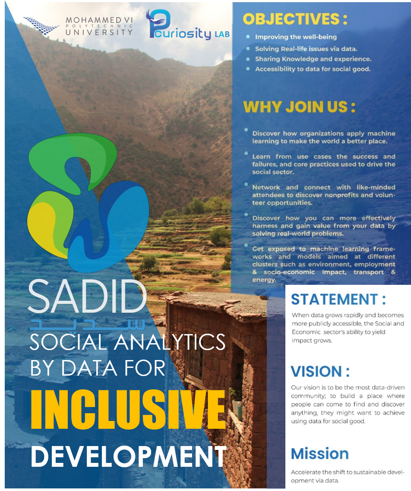
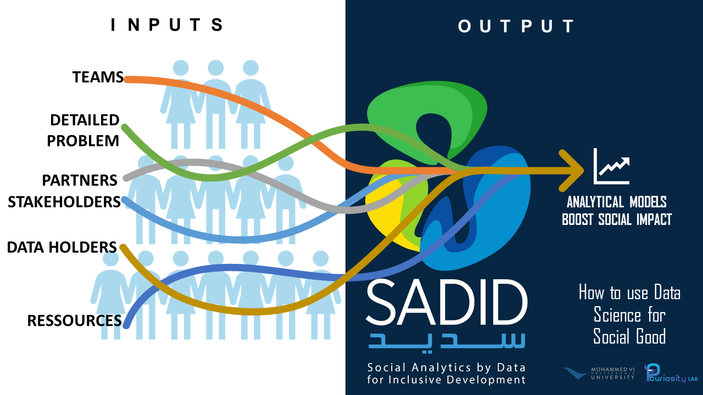

## Learn data for good use cases ...
# SADID

## Approach:

# Demystifying data for social good
## Use cases:
# 1
Identify individuals at the highest risk of becoming long-term unemployed and channel the employment institute’s limited resources to those most in need.
# 2
Targeted interventions to students with high risk of drop out of school the next year and coordinate with other branches of government to improve the impact of social programs in those schools that are more vulnerable.
# 3
Households tend to decrease their consumption when they have fewer resources. The UNDP Sudan office set out to test whether satellite data could be used to estimate poverty levels via changing night-time energy consumption. The team used data pulled from night-time satellite imagery, analyzing these illumination values over a two-year period, in conjunction with electric power consumption data provided by the national electricity authority. The proof-of-concept successfully showed that the availability of electricity can be measured from outer space and also reflected the energy poverty prevalent in the country
# 4
Low-income workers in Seoul needed a new transportation option for commuting late at night. There was no night bus service, and taxis were expensive and hard to find. To establish a new night bus route, city officials analyzed aggregated and anonymized mobile phone usage patterns to understand the most common points of departure and destination for travelers. This insight allowed officials to efficiently create a targeted “Owl Bus” route map, which best served late-night travelers. 

[ link](https://www.google.com)
